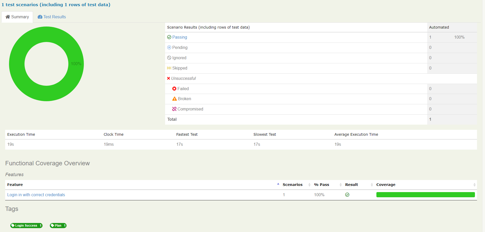
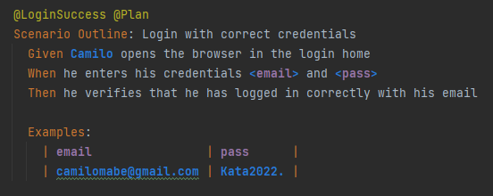
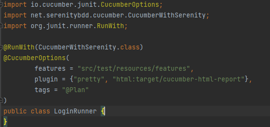
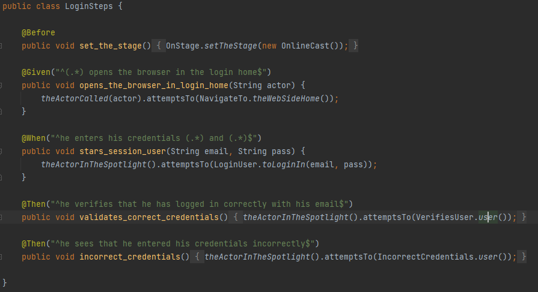
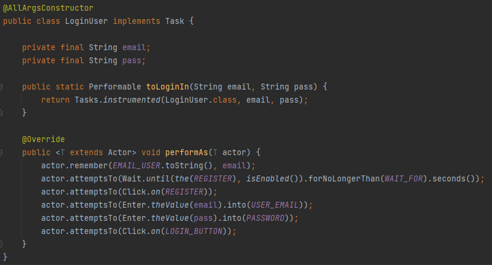

## Caracteristicas de un escenario en Hgerkin**
- Feature: Descripción a detalle del escenario.
- LoginSuccess tag que identifica el escenario.
- Plan tag que permite ejecutar todos los features.
- Scenario Outline: nombre de escenario.
- Given precondiciones para que se posible ejecutar la prueba.
- When Acciones realizadas por el usuario.
- Them resultado que se deben validar una vez finaliza la prueba.
- Examples: permite el login con multiles usuarios 

## Reporte generado del login

## Feature inicio de sesion

## Runner ejecuta mediante la etiqueta @Plan

## Steps Inicio de sesion

## Task Inicio de sesion

